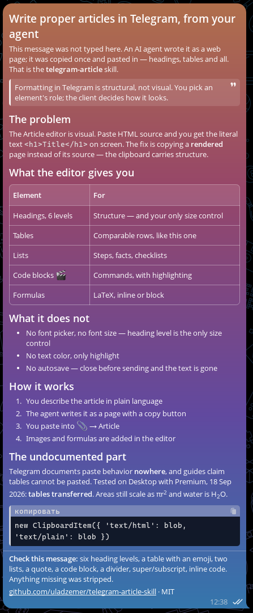
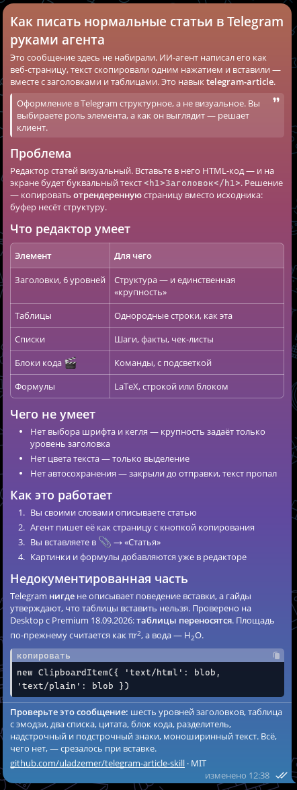

# Telegram Article Skill

<p align="center">
  <b>English</b> ·
  <a href="README.ru.md">Русский</a>
</p>

<p align="center">
  
  
</p>

<p align="center">
  <i>Written by an agent as a web page, copied once, pasted into Telegram's Article editor.<br>
  Headings, tables, lists, quotes and code blocks all survive the paste.</i>
</p>

An agent skill for writing well-formatted articles in Telegram's built-in
**Rich Text Editor** (paperclip 📎 → "Article", Telegram 12.9+) — headings, tables, lists,
quotes, collapsible blocks, images, carousels and LaTeX formulas.

Works with **Claude Code**, **Codex**, and other agents that read `SKILL.md` files.

## Two problems it solves

**Formatting in Telegram is structural, not visual.** There is no font picker, no font
size, no text color. You pick an element's *role* — heading level, quote, callout, code,
highlight — and the client renders it. Agents that promise "a nicer font" are promising
something that does not exist.

**The editor is WYSIWYG.** Paste HTML source into it and you get literal `<h1>` text on
screen. Every agent that hands you an HTML file to "paste into Telegram" produces exactly
that failure.

## The insight

**The editor accepts rich clipboard content.** Copy a *rendered* page from a browser —
not its source — and the formatting transfers: headings, lists, bold, links, and tables.

Telegram documents this nowhere. Published guides state that tables cannot be pasted.
We verified otherwise on Telegram Desktop (Windows, Premium) on 2026-09-18.

So the skill's deliverable is not "an HTML file". It is **a rendered page with a copy
button** that writes both `text/html` and `text/plain` to the clipboard.

The skill also covers the editorial side — which content shape wants a table versus a
list, where blocking requirements belong, how to use carousels and captions, and how to
hand over LaTeX formulas — plus honest limits: what the editor cannot do, and which
"clickable article" effects require a bot rather than the editor.

## What's in here

```
skills/telegram-article/
├── SKILL.md                            # the skill: workflow, structure rules, anti-patterns
├── references/
│   ├── editor-capabilities.md          # what the editor supports/strips, clipboard mechanics, limits
│   └── writing-patterns.md             # structures for launches, promos, digests, changelogs
└── assets/
    └── copy-button.html                # working drop-in template

examples/
└── showcase.html                       # two ready-to-paste articles (EN + RU) that
                                        # explain the skill and demo every element
```

**Try it in one minute — no install:** open **[uladzemer.github.io/telegram-article-skill](https://uladzemer.github.io/telegram-article-skill/)**,
press *Copy with formatting*, and paste into Telegram (📎 → Article). The pasted article
explains the skill and lists what to check. The same page lives in the repo as
[`examples/showcase.html`](examples/showcase.html).

Writing patterns included: product launch, promo, digest, how-to guide, longread,
technical writeup with math, and changelog.

## Install

**Claude Code** — copy the skill into your skills directory:

```bash
git clone https://github.com/uladzemer/telegram-article-skill.git
cp -r telegram-article-skill/skills/telegram-article ~/.claude/skills/
```

Project-scoped instead: copy it into `.claude/skills/` inside the repo.

**Codex / other agents** — point the agent at `skills/telegram-article/SKILL.md`,
or paste its contents into your instructions file.

## Use

Ask in plain language:

> Write a Telegram article about the new pricing, with a table of plans

> Turn this into a Telegram longread with proper headings and a pull-quote

> Сделай статью в телеграм про запуск — с таблицей и списком шагов

The agent produces an HTML page. Open it in a browser, press **Copy with formatting**,
then in Telegram: **📎 → Article → Ctrl+V**.

## Known limits

- The Article editor requires **Telegram Premium**.
- **No autosave** — closing the editor loses the text.
- Paste behavior is undocumented by Telegram and may vary by client or change between
  releases. **Test one paragraph before pasting a long text.**
- `ClipboardItem` needs a secure context (`https:` or `localhost`); the template falls
  back to `execCommand` elsewhere.

## Not for

**Interactive messages.** Telegram apps where you tap parts of the message and it responds
— the chess client, for example — are built with **Bot API Rich Messages** (10.3, August
2026): a bot posts a message with buttons *inside* the text and edits it in place on each
tap. An article author cannot make those in the editor. What an author *can* do is use
`t.me/…` and `tg://…` deep links as ordinary hyperlinks — including `?startapp=` to launch
a Mini App — which reads and behaves like a button. Covered in
`references/editor-capabilities.md`.

**Bot API** (`parse_mode=HTML`) — programmatic sending, ~11 inline tags, no headings or
tables. **Telegraph** — no Premium needed and gets Instant View, but only `h3`/`h4`
headings and no tables. Both covered in `references/editor-capabilities.md`.

## License

MIT — see [LICENSE](LICENSE).
